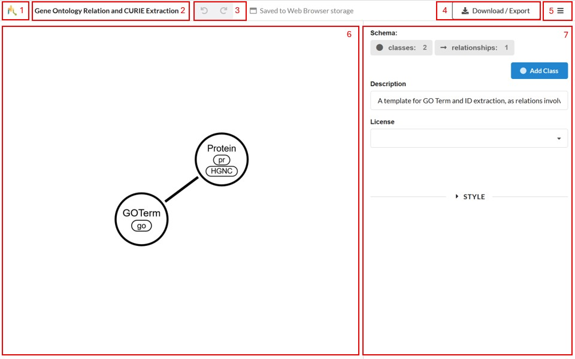

## Overview

<!-- ema This is how the general view of schemalink looks like: -->
The figure below describes SchemaLink canvas and side panels.

<!-- In this view you can find: -->

1. The main menu. The menu opens when hovering over the schemalink logo and
   contains actions such as creating a new schema, or importing an existing one.
2. The schema name, editable by clicking on it.
3. The undo/redo buttons.
4. The download/export button, which opens the export dialog.
5. The inspector toggle, which shows or hides the inspector.
6. The canvas, showing the schema.
7. The inspector, showing the properties of the schema or any selected item.
